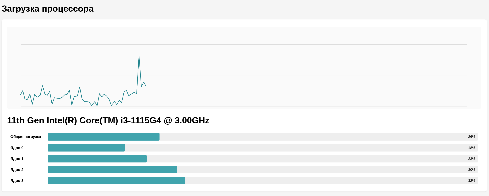
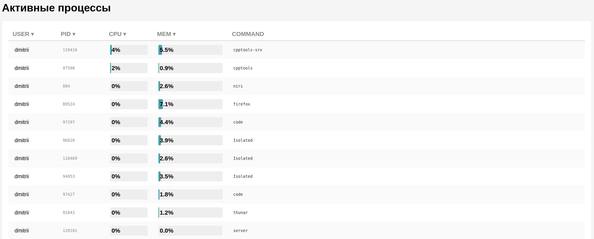

### YADRO тестоое задание
## Установка зависимостей
Для сборки необходимы зависимости:
* g++
* cmake
* base-devel (build-essentials)
Их загрузку можно провести при помощи скрипта:
```
./install.sh 
```
## Сборка
Для работы приложения необходим фреймворк crow. Для работы crow необходима библиотека boost. Обе библиотеки находятся в файлах проекта (vendor/). Сборка код производится скриптом:
```
./build_server.sh 
```
## Запуск сервера
```
./start.sh 
```
## Работа
После запуска, приложение доступно по адресу:
```
http://127.0.0.1:18080/
```
## Диагностика процессора

## Диагностика оперативной памяти

## Просмотр процессов
Для сортировки по конкретноу параметру, необходимо нажать на соответствующий столбец таблицы

